# Amazon VPC Troubleshooting Project: EC2 Public Access and Connectivity

## Project Overview

This project documents the process of troubleshooting and fixing a broken Amazon VPC that had no internet connectivity. An EC2 instance was launched successfully but could not be accessed via SSH and had no outbound internet access. The goal was to identify every misconfiguration and correct it step by step until the VPC behaved like a proper public network.

---

## Initial State of the VPC

The VPC was created with CIDR block `10.0.0.0/16`, but it was completely isolated from the internet.

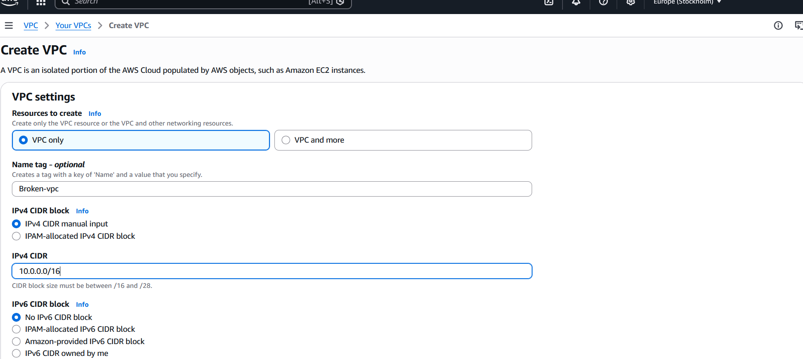

A single subnet was created inside the VPC. At this stage, the subnet had no internet access and was not configured as a public subnet.

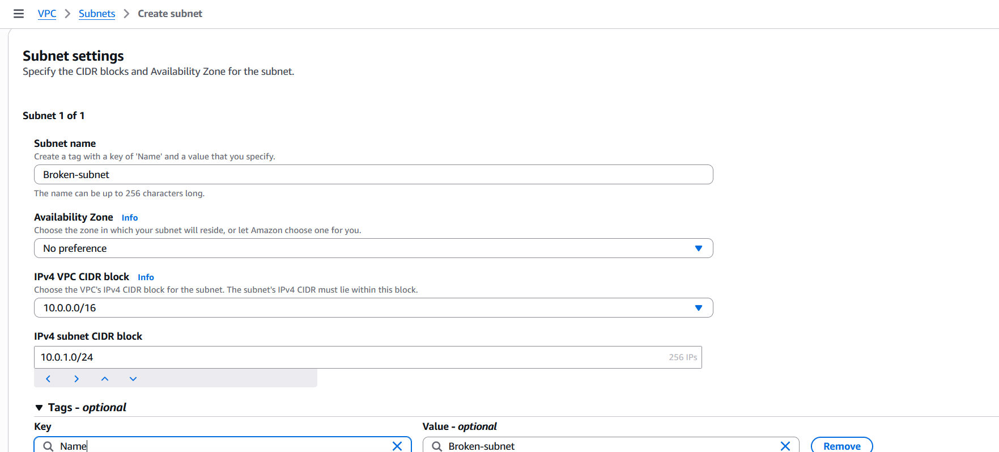

---

## Missing Internet Gateway

The VPC had no Internet Gateway attached. Without an Internet Gateway, there is no path for traffic to enter or leave the VPC.

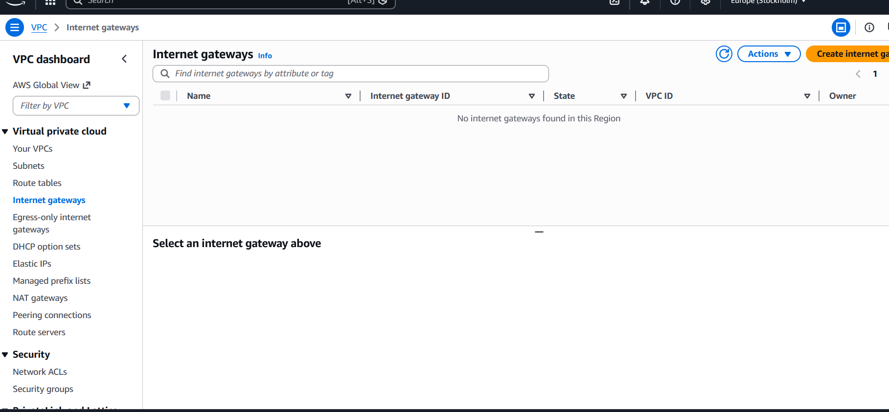

---

## Route Table Misconfiguration

The default route table only contained the local route. There was no route directing traffic to the internet.

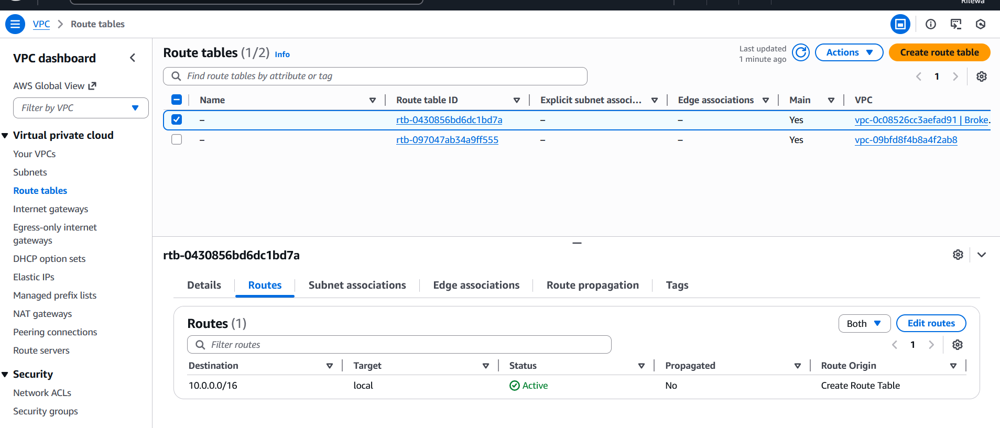

---

## EC2 Instance in a Broken Subnet

An EC2 instance was launched inside the subnet. Even though the instance was running, it was effectively isolated.

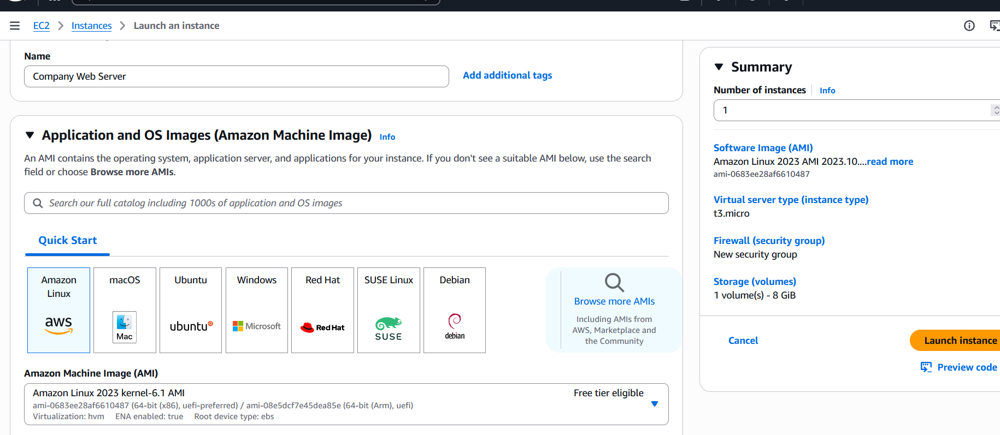

---

## Security Group Issues

The security group attached to the instance had restricted outbound rules. This meant that even if routing was fixed later, traffic would still be blocked.

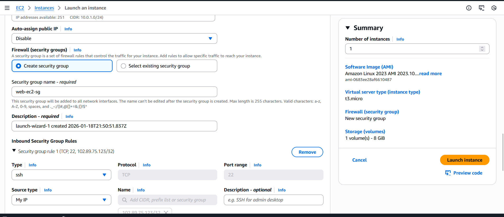
Outbound traffic was completely blocked at this stage.

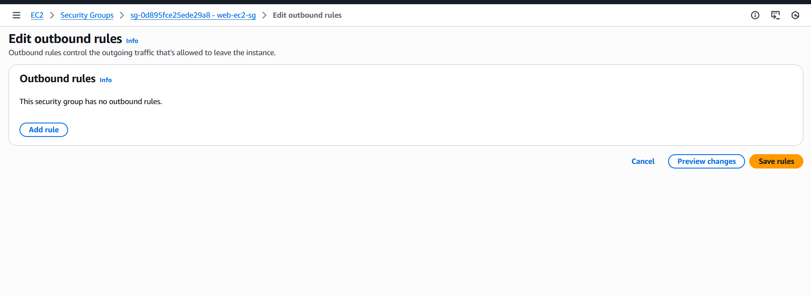

---

## Connectivity Failure

SSH attempts to the instance failed due to the lack of internet access.

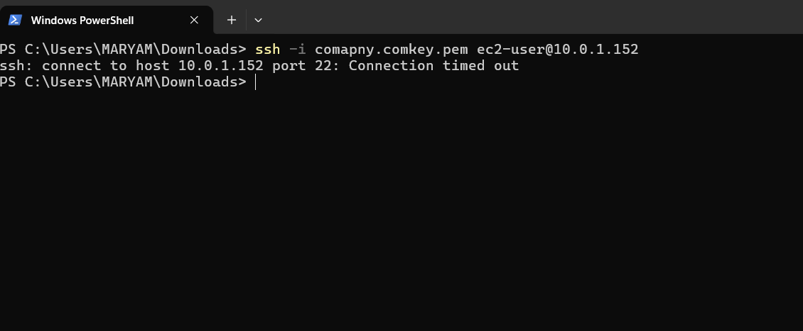

The instance also had no public IPv4 address, which made internet communication impossible.

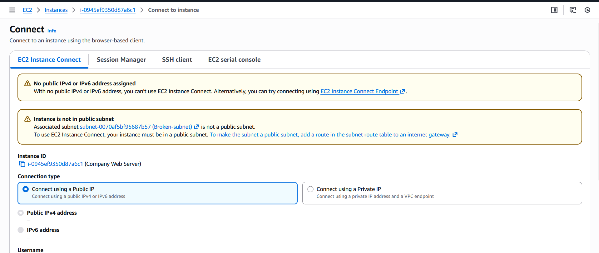

---

## Fix 1: Internet Gateway Creation

An Internet Gateway was created to provide the VPC with a path to the internet.

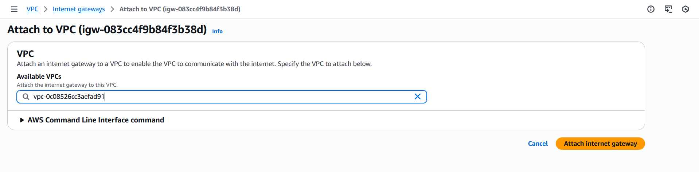

---

## Fix 2: Public Route Table Creation

A new route table was created specifically to handle internet-bound traffic.

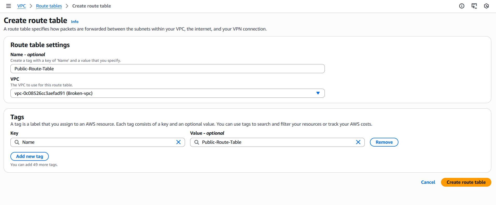
The route table was edited to include a default route that sends all outbound traffic to the Internet Gateway.

Destination: `0.0.0.0/0`  
Target: Internet Gateway

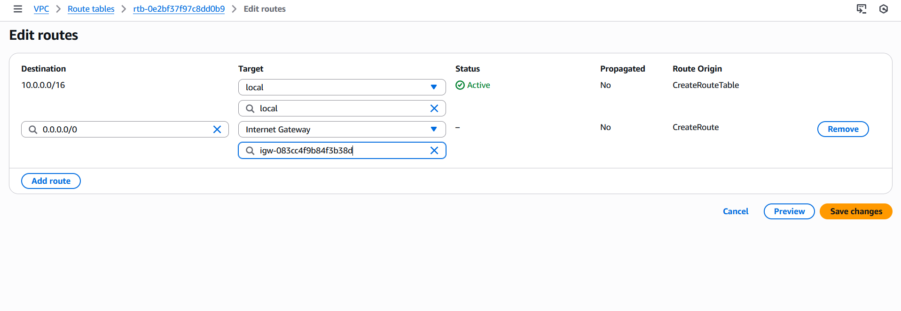

---

## Fix 3: Subnet Association

The subnet was explicitly associated with the public route table. This step is required for the subnet to actually follow the new routing rules.

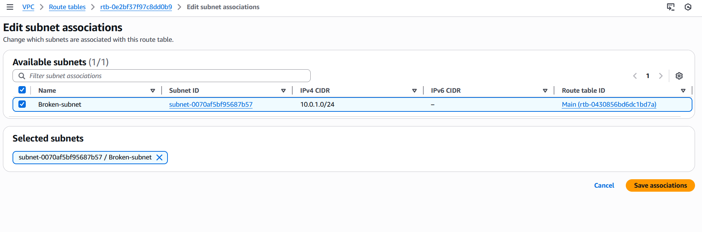

---

## Fix 4: Auto-Assign Public IPv4 Address

Auto-assign public IPv4 was enabled on the subnet. Without this, EC2 instances would still launch without a public IP even with correct routing.

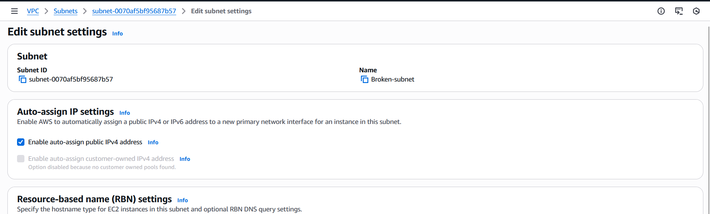

---

## Fix 5: Security Group Outbound Rule

An outbound rule was created in the security group to allow traffic to leave the instance. Routing alone is useless if traffic is blocked at the security group level.

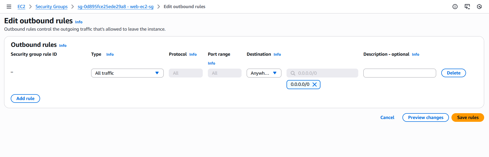

---

## Fix 6: Elastic IP Allocation

Even after enabling auto-assign public IPv4, a public IP was still not visible on the instance. An Elastic IP was allocated to provide a static public IPv4 address.

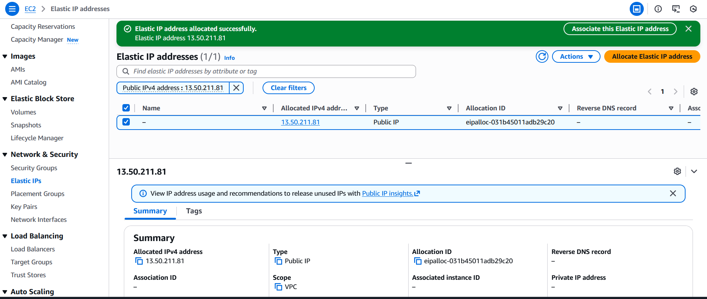

The Elastic IP was associated with the EC2 instance.

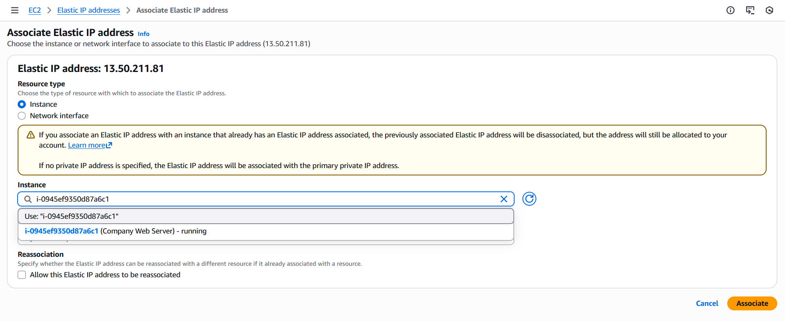

After association, the public IPv4 address became visible on the instance.

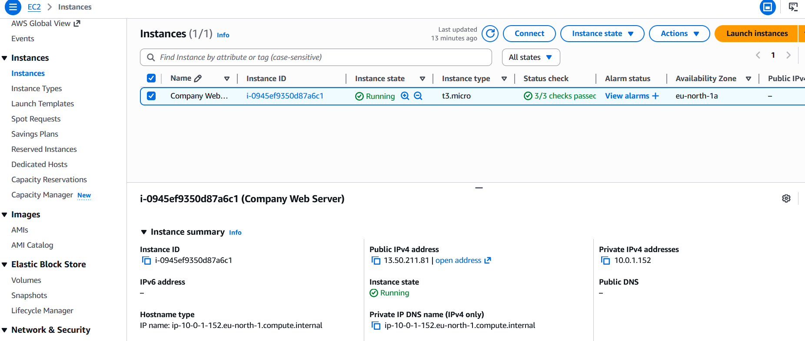

---

## Validation and Testing

After all fixes were applied, SSH access was tested again and succeeded. Internet connectivity was also verified.

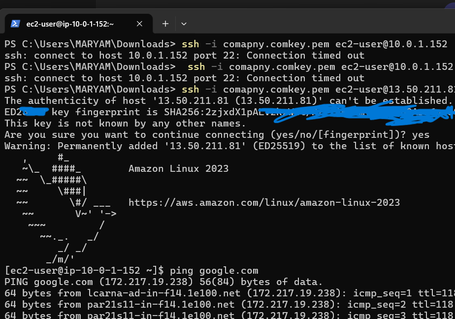

---

## Conclusion

This project showed the practical side of Amazon VPC networking. While VPC concepts may seem clear during exam preparation, real troubleshooting exposes gaps in understanding. Key lessons reinforced include the role of Internet Gateways, route tables, subnet associations, security group rules, and the importance of Elastic IPs when a stable public address is required.

At the end of the project, the EC2 instance had full internet access, SSH connectivity worked, and the VPC functioned as a proper public network.

---

## Cleanup Reminder

Always remember to delete AWS resources after completing a project to avoid unnecessary charges. Only keep resources running if they are intended for future use.

